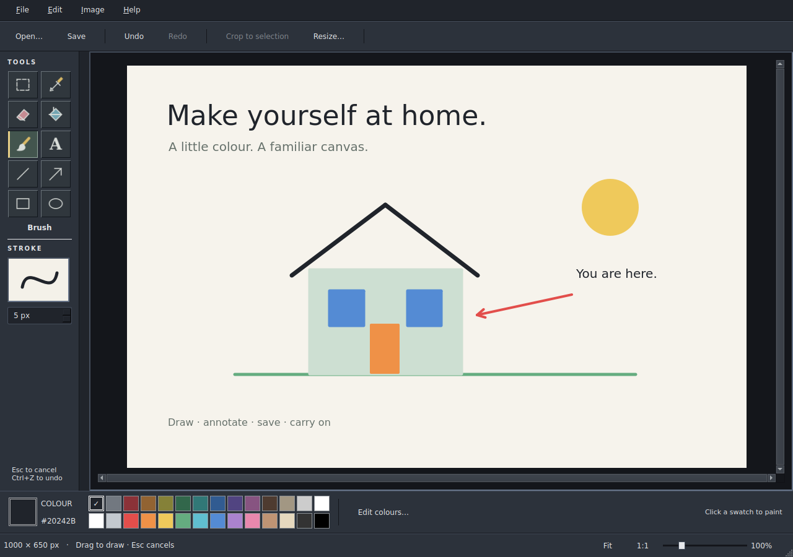

<h1 align="center">Familiar Paint</h1>

<p align="center">Draw something. Circle the important bit. Save it and carry on.</p>

<p align="center">
  <a href="https://github.com/tcballard/omarchy-badges"></a>
</p>

Familiar Paint is a native drawing and image editing app for Omarchy. A classic toolbox, a canvas and a row of colours for quick sketches, annotations and everyday edits. Use the mouse yourself, or give your coding agent the CLI and let it draw.



*Actual app capture on Ubuntu using Qt's offscreen backend. An Omarchy desktop capture is still pending.*

[**Try the preview →**](#try-familiar-paint)

## Make yourself at home

- **Draw and annotate.** Brushes, fill, shapes, arrows and text, with undo and redo.
- **Make quick edits.** Select, crop, resize, rotate and flip an image, then save as PNG, JPEG or BMP.
- **Keep familiar controls.** A two-column toolbox, square colour swatches, brush preview and zoom controls.
- **Let your agent paint.** Run JSON drawing commands, render without a window, or send changes to an open canvas.
- **Fit your desktop.** Follow supported Omarchy theme colours while keeping your artwork unchanged.

## Try Familiar Paint

Preparing to test on the XPS? See the [binary preview setup](docs/PREVIEW-INSTALL.md),
[desktop test and live recording checklist](docs/XPS-TEST.md), and
[release procedure](docs/RELEASE.md).

**Preview, version 0.0.2.** Download the prebuilt archive from [Releases](https://github.com/tcballard/omarchy-app-familiar-paint/releases). There is no Omarchy package yet. The intended target is Omarchy 4 / Hyprland on Linux x86_64; testing on an installed Omarchy desktop remains outstanding.

<a id="run-paint"></a>

Download the Linux x86_64 archive and `SHA256SUMS` from the release. No compiler or language toolchain is needed. Close Paint before upgrading.

```bash
sudo pacman -S --needed qt6-base qt6-wayland
sha256sum -c SHA256SUMS
tar -xzf familiar-paint-0.0.2-linux-x86_64.tar.gz
cd familiar-paint-0.0.2-linux-x86_64
bash scripts/install.sh
"$HOME/.local/bin/familiar-paint"
```

Open **Familiar Paint** from your app launcher after installing. Installation leaves your default image associations and personal keybindings alone.

[Build from source →](docs/GUIDE.md#run-paint) · [Installation and rollback →](docs/PREVIEW-INSTALL.md)

## Let your agent paint

Start a window with agent control enabled:

```bash
familiar-paint --listen studio
```

In another terminal, from the repository folder:

```bash
familiar-paint --send studio --apply examples/house.json
familiar-paint --send studio --export house.png
familiar-paint --send studio --undo
```

Each drawing batch is one undo step. Live edits use revision checks, and **Stop agent** in the status bar switches control off. Your agent supplies the drawing commands; no language model or account is built in.

[CLI guide and command reference →](docs/AGENT-CLI.md)

<a id="cli-welcome-demo"></a>

[Watch the welcome demo](demo-video/familiar-paint-welcome.mp4): six CLI batches build a welcome card. The video uses real app captures in staged playback; it does not show live socket control.

## A few useful details

The native build, test suite—including the live CLI/socket round trip—and desktop launcher validation [passed on GitHub's Ubuntu runner](https://github.com/tcballard/omarchy-app-familiar-paint/actions/runs/37185638348). This does not establish compatibility with a real Omarchy session.

Save regularly: autosave and crash recovery are not implemented. Layers, movable pasted objects and non-destructive text editing are also not available yet. The eraser paints white; PNG preserves existing transparency. [Features and preview limits →](docs/GUIDE.md#deliberate-preview-limits)

<a id="remove-or-roll-back"></a>

To remove a default user installation, close Paint and run `bash scripts/uninstall.sh` from the repository. Your saved images are kept. [Custom prefixes and rollback →](docs/GUIDE.md#remove-or-roll-back)

<a id="build-from-source"></a>
<a id="verification-and-next-acceptance"></a>

[Development guide](docs/GUIDE.md#build-from-source) · [Verification record](VERIFICATION.md) · [Architecture](ARCHITECTURE.md) · [Report a bug](https://github.com/tcballard/omarchy-app-familiar-paint/issues)

MIT licensed. [Credits](CREDITS.md). Made by [Tom Ballard](https://github.com/tcballard).
